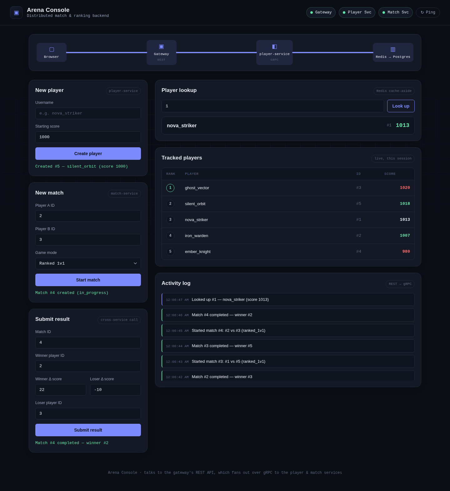
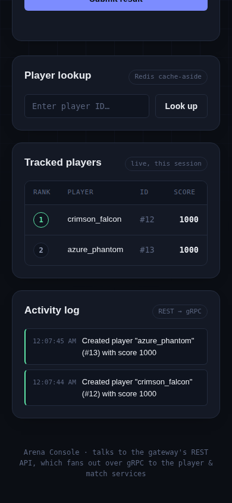
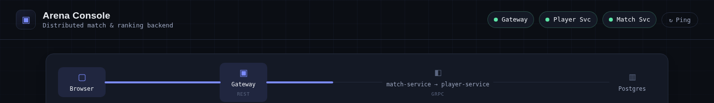

# Distributed Multiplayer Game Backend



A distributed backend platform for multiplayer games built with **C++, gRPC, Redis, PostgreSQL, Node.js, Docker, and Kubernetes**.

The system manages player accounts, scores, match results, and leaderboards through independently deployable microservices communicating over gRPC. A REST API gateway and interactive web dashboard provide real-time visibility into system activity, request flow, and service health.

---

## Highlights

- Built distributed microservices using **C++ and gRPC** with independent Player and Match services.
- Implemented **Redis caching** and **PostgreSQL indexing** to optimize player lookups and database performance.
- Added **retry logic, request deadlines, and circuit breakers** for fault-tolerant service communication.
- Containerized services using **Docker** and prepared **Kubernetes** deployments with autoscaling support.
- Developed a real-time monitoring dashboard with live request tracing and health checks.

---

## Key Features

### Distributed Microservices Architecture
- Independent Player and Match services built in C++
- Service-to-service communication using gRPC
- REST API Gateway built with Node.js and Express
- Independent deployment and scaling of services

### Performance Optimization
- Redis cache-aside pattern for low-latency reads
- PostgreSQL persistence with optimized indexing
- Thread-safe database connection pooling
- Retry with exponential backoff for transient failures

### Reliability & Fault Tolerance
- Circuit breaker protection between services
- Request deadlines and retry mechanisms
- Aggregate health checks (`/healthz`, `/readyz`)
- Graceful degradation during service failures

### Infrastructure & DevOps
- Dockerized microservices
- Kubernetes deployment manifests
- Horizontal Pod Autoscaling (HPA)
- GitHub Actions CI pipeline
- Load testing using k6

---

## Architecture

```text
                ┌─────────────┐
   HTTP/REST    │   Gateway    │
  Client ─────▶ │  (Node.js)   │
                └──────┬───────┘
                       │ gRPC
          ┌────────────┼─────────────┐
          ▼                          ▼
  ┌───────────────┐          ┌───────────────┐
  │ Player Service │◀── gRPC ─│ Match Service │
  │     (C++)      │          │     (C++)     │
  └───┬───────┬────┘          └───────┬───────┘
      │       │                       │
      ▼       ▼                       ▼
  ┌──────┐ ┌────────────┐      ┌────────────┐
  │Redis │ │ PostgreSQL │      │ PostgreSQL │
  └──────┘ └────────────┘      └────────────┘
```

---

## Dashboard & Request Tracing

### Arena Console



The built-in dashboard allows users to:

- Create players
- Start matches
- Submit results
- View leaderboards
- Monitor service health
- Track system activity in real time

### Live Request Trace



The dashboard visualizes actual service interactions. When match results are submitted, the trace highlights the live request path between services, providing visibility into the underlying distributed workflow.

---

## Design Decisions

- **Microservices over monolith:** Player management and match processing were separated to enable independent scaling and deployment.
- **Redis cache-aside pattern:** Frequently accessed player data is cached while PostgreSQL remains the source of truth.
- **gRPC for internal communication:** Provides efficient, strongly typed service-to-service communication.
- **Circuit breaker protection:** Prevents cascading failures when dependent services become unavailable.

---

## Technology Stack

| Category | Technologies |
|-----------|-------------|
| Languages | C++, JavaScript |
| Backend | Node.js, Express |
| Communication | gRPC, REST APIs |
| Database | PostgreSQL |
| Cache | Redis |
| Containers | Docker |
| Orchestration | Kubernetes |
| Testing | Smoke Tests, k6 |
| CI/CD | GitHub Actions |

---

## Running Locally

### Clone Repository

```bash
git clone https://github.com/Harikasan/distributed-game-backend.git
cd distributed-game-backend
```

### Start Services

```bash
docker compose up --build
```

### Access Dashboard

```text
http://localhost:8080
```

### Run Smoke Test

```bash
chmod +x scripts/smoke_test.sh
BASE_URL=http://localhost:8080 ./scripts/smoke_test.sh
```

---

## API Endpoints

| Method | Endpoint | Description |
|----------|-----------|-------------|
| POST | `/api/players` | Create a player |
| GET | `/api/players/:id` | Retrieve player details |
| PATCH | `/api/players/:id/score` | Update player score |
| POST | `/api/matches` | Create a match |
| GET | `/api/matches/:id` | Retrieve match details |
| POST | `/api/matches/:id/result` | Submit match results |
| GET | `/healthz` | Gateway liveness |
| GET | `/readyz` | System readiness |

---

## Production-Oriented Features

- Redis cache-aside architecture
- PostgreSQL indexing
- Thread-safe connection pooling
- Retry with exponential backoff
- Request deadlines
- Circuit breaker pattern
- Health and readiness checks
- Dockerized services
- Kubernetes deployment manifests
- Horizontal Pod Autoscaling
- GitHub Actions CI pipeline
- Load testing with k6

---

## Load Testing

The project includes a k6 workload simulation that generates concurrent multiplayer traffic and measures latency under load.

```bash
k6 run -e BASE_URL=http://localhost:8080 scripts/load_test.js
```

This can be used to evaluate the impact of Redis caching and PostgreSQL indexing on application performance.

---

## CI/CD

GitHub Actions automatically:

- Builds C++ services
- Lints Node.js code
- Builds Docker images
- Runs integration tests
- Executes smoke tests

---


## License

MIT License
